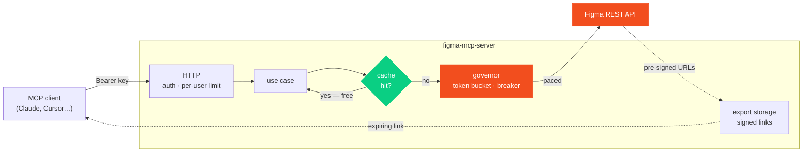

<div align="center">

# figma-mcp-server

**Self-hosted, read-only [MCP](https://modelcontextprotocol.io) server for Figma —
built for a team that shares one Figma seat and one rate-limit budget.**

[](https://www.npmjs.com/package/@hanoilab/figma-mcp-server)
[](https://github.com/nguyendinhphongdx/figma-mcp-server/actions/workflows/ci.yml)
[](https://nodejs.org)
[](https://modelcontextprotocol.io)
[](#security-model)

[Quick start](#quick-start) · [Tools](#tools) · [How it works](#how-it-works) · [Configuration](#configuration) · [Security](#security-model) · [Limitations](#limitations)

</div>

---

Why not just use the official Figma MCP? This server does not raise Figma's limits — it cannot; it calls the same REST API
with the same per-token quota. What it adds is **control over how that quota is spent**, and tools shaped for the job
people actually do with it: turning a design into code.

## Highlights

|  | |
| --- | --- |
| ⏱️ **One shared governor** | Paces every Figma call, opens a circuit breaker on `429` and answers immediately with a precise "retry in N minutes" instead of hammering Figma (which only extends the penalty). |
| 🗃️ **Shared cache, single-flight** | Ten teammates asking for the same file cost one Figma request — not ten. Concurrent callers join one in-flight request. |
| 🎨 **Design-to-code in two requests** | `figma_get_node_spec` flattens a frame into CSS declarations and text; `figma_get_svg` returns pasteable icon source. |
| 📦 **Bulk export done right** | All nodes batched into as few `GET /v1/images` calls as possible, URLs cached 29 days, images served as signed expiring links instead of flooding the model's context. |
| 🔐 **Read-only by design** | No write path to Figma at all. Per-user API keys, file allow-list, SSRF-guarded downloads, signed links. |
| 🖥️ **Admin UI + CLI** | `fmcp start` and a browser: set the Figma token, add users, read the docs. No `.env` editing, no restart. |

## Quick start

> Requirements: **Node ≥ 20.6**

### CLI (recommended)

```bash
npm install -g @hanoilab/figma-mcp-server
fmcp init      # creates ~/.fmcp/.env with a generated signing secret
fmcp start     # starts in the background, prints the Admin UI URL
```

Open the URL it prints (`http://localhost:3000/` by default). The first visit walks you through creating an admin
account, then setting the Figma token and adding users. `fmcp logs -f` / `fmcp status` / `fmcp stop` manage the process.

<details>
<summary><b>From source</b></summary>

```bash
pnpm install --frozen-lockfile
cp .env.example .env    # only PUBLIC_BASE_URL and DOWNLOAD_SIGNING_SECRET are required
pnpm dev
```

Then open `PUBLIC_BASE_URL` in a browser to finish setup (Figma token, admin account, users) — same Admin UI as above.
`FIGMA_TOKEN` / `MCP_API_KEYS` in `.env` are optional and only seed that setup for scripted deployments
(see [`.env.example`](.env.example)).

</details>

<details>
<summary><b>Docker</b></summary>

```bash
docker build -t figma-mcp-server .
docker run --env-file .env -p 3000:3000 -v figma-mcp-data:/data figma-mcp-server
```

Terminate TLS in front of it (reverse proxy or ingress) and set `PUBLIC_BASE_URL` to the public https origin.

</details>

### Figma token

Create a personal access token on a **dedicated service account** with the scopes `file_content:read`,
`file_comments:read` and `library_content:read`. All MCP users share this identity, so **share only the files you want
exposed with that account**, and set `FIGMA_ALLOWED_FILE_KEYS` as a second fence. Paste it into the Admin UI — it
applies immediately, no restart.

### Connect a client

Give each user their own key from the Admin UI (or `fmcp key <name>`). Users keep it in an environment variable and
reference it from `.mcp.json` (see [`examples/mcp.json`](examples/mcp.json)):

```json
{
  "mcpServers": {
    "figma-team": {
      "type": "http",
      "url": "https://figma-mcp.your-company.example/mcp",
      "headers": { "Authorization": "Bearer ${FIGMA_MCP_API_KEY}" }
    }
  }
}
```

## Tools

Every result is cached; `refresh: true` re-reads from Figma. Costs are for a **cold cache** — a hit is free and instant.

| Tool | Cost | Purpose |
| --- | :-- | --- |
| `figma_search_nodes` | `free` ¹ | Find layers by name (diacritic-insensitive), ranked by relevance; returns ids, type, page and path. |
| `figma_list_frames` | `1 × T1` | Pages and top-level frames/sections/components with ids and sizes. Paged. |
| `figma_get_node_spec` | `1 × T1` ² | A frame flattened into CSS declarations and text — what you implement from. |
| `figma_get_node_tree` | `1 × T1` ² | Figma's exact structure with raw field values; capped by `maxNodes`. |
| `figma_get_svg` | `⌈n/100⌉ × T1` | SVG source of icons and vectors, inline and ready to paste. |
| `figma_export_frames` | `⌈n/100⌉ × T1` | Bulk export to jpg/png/svg/pdf; signed links and a zip. `inline: true` also returns the images. |
| `figma_list_styles` | `1 × T3` | Published styles with node ids. |
| `figma_list_components` | `1 × T3` | Published components (main file only). |
| `figma_get_design_tokens` | `1 × T3 + 1 × T1/100` | Colours, typography, shadows; optional CSS custom properties. Variables not included. |
| `figma_get_comments` | `1 × T2` | Comment threads with replies, resolved state and pinned node. |
| `figma_quota_status` | `free` | Requests used, free slots and active penalties per tier. |

<sub>¹ Reuses the cached file outline. `deep: true` costs `1 × T1` per file and depth. &nbsp;&nbsp; ² All ids batched into one request.</sub>

Tool descriptions state their own cost, so a model can plan around the budget without being told.

### Design to code

Real Figma files are full of layers that hold nothing — `Data > Margin > Container > Container > TEXT` is ordinary. So
the frame carrying the padding and background sits three or four levels above its own text, and every `depth` you pick
is wrong in one direction: too shallow and the text is missing, too deep and you pull back the whole subtree.

`figma_get_node_spec` reads deep by default, drops those wrapper layers and returns CSS declarations plus every string
on the screen. It lists the frame's vector layers in `vectorNodes`; `figma_get_svg` turns those into pasteable source —
the one thing no node tree contains, since the REST API describes a `VECTOR` by its bounds and colour but never its path.

```jsonc
// figma_get_node_spec → nodes["1408:9840"]
{
  "name": "Button", "type": "FRAME", "sizing": { "horizontal": "HUG" },
  "css": { "display": "flex", "align-items": "center", "gap": "8px",
           "padding": "8px 16px", "border-radius": "8px", "background": "#2563eb" },
  "children": [{ "type": "TEXT", "text": "Tạo vai trò tùy chỉnh",
                 "css": { "color": "#ffffff", "font-family": "Inter", "font-size": "14px" } }]
}
```

That's **two Figma requests for a full screen**. The Admin UI's *Design to code* page has the full recipe, including
what the API will never give you.

## How it works



Every request arrives authenticated and per-user rate limited. A use case asks the cache first — a hit never reaches
Figma. A miss goes through the governor, which paces it against the tier budget and fails fast if a `429` penalty is
active. Exported images are downloaded once into server storage and handed back as signed, expiring links.

<details>
<summary><b>Source layout</b> — hexagonal, dependencies point inward</summary>

```text
src/
  cli.ts                     `fmcp` CLI: start/stop/status/logs/init, spawns main.js
  main.ts                    process entry: config, logger, graceful shutdown
  app.ts                     composition root (wires ports to adapters)
  config/                    zod-validated environment -> typed AppConfig
  core/                      framework-free building blocks
    domain/                  errors, Figma URL / node-id parsing
    admin/                   AdminStore (hot-reloadable Figma token + users), admin sessions
    figma/                   FigmaApi port, HTTP adapter, image downloader
    rate-limit/              token-bucket governor + per-tier circuit breaker
    cache/                   memory LRU, disk, layered cache, CachedLoader (single-flight)
    security/                API keys, URL signer, file allow-list, image URL (SSRF) policy
    storage/                 ExportStorage port + local-disk adapter, file naming
  features/                  one use case per capability (frames, search, nodes, export, library, tokens, comments, quota)
  adapters/
    mcp/                     tool registration and error mapping (McpServer)
    http/                    /mcp, Admin UI + API, signed downloads, zip streaming, limiter
  infra/                     logger, retry with backoff, bounded concurrency
```

- **Stateless Streamable HTTP.** Each `POST /mcp` builds a fresh `McpServer` for the authenticated principal, so
  instances can be added behind a load balancer without sticky sessions (see [Limitations](#limitations) for what is
  still per-instance).
- **Ports for everything that changes.** `FigmaApi`, `RateLimitGate`, `CachePort`, `ExportStorage`, `DownloadLinks` and
  `Logger` are interfaces; swapping the disk cache for Redis or disk storage for S3 touches `app.ts` and one adapter.
- **Errors are values for the model.** Domain errors map to MCP tool results with `isError: true` and an actionable
  message (what failed, when to retry, which scope is missing) rather than protocol errors.

</details>

## Configuration

All configuration is environment variables, validated at start-up — the process exits with code `78` and a readable list
of problems otherwise. Full list in [`.env.example`](.env.example).

| Variable | Required | Notes |
| --- | :-: | --- |
| `PUBLIC_BASE_URL` | ✅ | Origin used to build download links and the Admin UI URL. |
| `DOWNLOAD_SIGNING_SECRET` | ✅ | ≥ 32 characters. Rotating it invalidates outstanding links. `fmcp init` generates it. |
| `FIGMA_TOKEN` | — | Service-account token. Only seeds the Admin UI on first run; set it there instead. Never logged. |
| `MCP_API_KEYS` | — | `name=<sha256 hex>` pairs; only seeds the Admin UI on first run — add users there instead. |
| `FIGMA_ALLOWED_FILE_KEYS` | ⚠️ | Recommended. Empty means **every file the token can open**. |
| `FIGMA_TIER{1,2,3}_RPM` | — | Defaults `10 / 25 / 50`, matching a Professional Dev/Full seat. Tune to your plan. |
| `IMAGE_HOST_ALLOWLIST` | — | Default `amazonaws.com,figma.com`. See [Limitations](#limitations). |

> [!IMPORTANT]
> Figma's limits depend on plan **and** seat type — Tier 1 is 10 / 15 / 20 requests per minute for Dev/Full seats on
> Professional / Organization / Enterprise, and far lower for View/Collab seats. Check the current numbers in
> [Figma's rate limit docs](https://developers.figma.com/docs/rest-api/rate-limits/) and set the `*_RPM` values
> accordingly. **The governor can only keep you under the number you give it.**

## Security model

<details>
<summary><b>Threats and mitigations</b></summary>

| Threat | Mitigation |
| --- | --- |
| Unauthenticated access | Bearer API key on `/mcp`; keys are 256-bit random, stored as SHA-256, compared in constant time. |
| A leaked env dump | Only key hashes are configured; the Figma token is redacted from logs. |
| One user or agent loop burning the team's quota | Per-user sliding-window limit plus the shared governor. |
| Every user seeing every file the token can open | `FIGMA_ALLOWED_FILE_KEYS`. |
| Cross-site calls from a browser | Requests carrying an `Origin` header are rejected unless listed in `ALLOWED_ORIGINS`. |
| SSRF through image URLs | https only, host suffix allow-list, no credentials, redirects refused, size cap; the Figma token is never sent to the CDN. |
| Guessable / forever-valid download links | HMAC-SHA256 signed, expiring (`DOWNLOAD_URL_TTL_SECONDS`), constant-time verified, generic 403 on any failure. |
| Path traversal | Export ids are 32 hex characters; file names are re-validated on read and sanitised on write. |
| Partial / corrupt files | Atomic writes (`.part` then rename); mid-stream download errors abort the file. |
| Unauthorised admin access | Admin UI/API needs a separate admin login, unrelated to `MCP_API_KEYS`; passwords hashed with scrypt, sessions are random 256-bit cookies (`HttpOnly`, `SameSite=Lax`, `Secure` over https). |
| Admin login brute force | Sliding-window rate limit on `/api/admin/login`. |
| CSRF against the Admin API | Same-origin check (request `Origin`, when present, must match the request's own `Host`). |

</details>

> [!WARNING]
> Download links are **bearer links**: anyone who has one can fetch that file until it expires. Treat them like a
> short-lived secret.

## Operations

| | |
| --- | --- |
| **Health** | `GET /healthz` |
| **Admin** | `PUBLIC_BASE_URL/` — Figma token, admin account, users, docs. Session TTL 12 hours. |
| **Logs** | JSON on stdout (pino). Each tool call logs tool, principal, duration and outcome — never tokens or keys. |
| **Housekeeping** | Every 10 min: exports past `EXPORT_RETENTION_HOURS`, expired cache files and admin sessions are removed. |
| **Shutdown** | `SIGTERM` / `SIGINT` stop accepting connections and drain; hard exit after 10 s. |
| **Backups** | Back up `<DATA_DIR>/admin.json` (Figma token, user key hashes, admin account). Everything else is cache or temporary exports. |

## Limitations

Read these before running more than one instance.

- **The governor's state is per process.** An active `429` penalty survives a restart (it is written to
  `<DATA_DIR>/governor.json`), but two instances would each pace against the full budget and neither would see the
  other's traffic. Run a single instance, or replace `TokenBucketGovernor` with a Redis-backed `RateLimitGate`
  (the port is small).
- **Cache, exports and `admin.json` are on local disk**, and admin sessions are in memory. With several instances, put
  `DATA_DIR` on shared storage (or swap in a different `CachePort` / `ExportStorage`) and expect to log into the Admin
  UI separately on each instance.
- **The image-host allow-list default is unverified.** Figma's image endpoint currently returns pre-signed S3 URLs
  (`*.amazonaws.com`), but that is an implementation detail Figma does not document as a contract. If exports fail with
  `Image host ... is not in IMAGE_HOST_ALLOWLIST`, add the host from the error after confirming it is legitimate.
- **Figma bills `GET /v1/files` by response size, and does not publish the formula.** The governor now charges a
  response extra slots for its size (`FIGMA_COST_BYTES_PER_UNIT`), but the ratio is a guess, and the charge lands
  *after* the response arrives — so one very large first call can still overshoot. This is why `figma_search_nodes`
  defaults to a shallow search and why `deep: true` carries a warning.
- **Figma Variables are not exposed.** The Variables REST API needs an Enterprise plan; tokens are derived from
  published styles only.
- **Styles and components** are read from the file's published library and need the main file, not a branch.
- **Comment message text** is not part of Figma's documented comment type; the server reads it defensively.
- **MCP SDK v1.x is pinned.** A v2 of `@modelcontextprotocol/sdk` exists; moving to it is a contained change in
  `src/adapters`.

## Development

```bash
pnpm typecheck
pnpm test        # unit + integration
pnpm build
```

Integration tests start the real server and talk to it through the official MCP client against an in-process fake of the
Figma REST API and image CDN ([`test/support/fake-figma.ts`](test/support/fake-figma.ts)), including scripted `429`s,
unrenderable nodes and CDN failures.

> [!NOTE]
> Tests **never contact the real Figma API**. Verify a new deployment with `figma_quota_status` and
> `figma_list_frames` on a real file before rolling it out.

<details>
<summary><b>Adding a tool</b></summary>

1. Add a method to the `FigmaApi` port if a new endpoint is needed, and implement it in `http-figma-api.ts` with the
   right tier.
2. Write a use case under `src/features/<name>/` that depends only on ports.
3. Wire it in `src/app.ts` and register it in `src/adapters/mcp/tools.ts`, **stating the Figma cost in the description**.
4. Cover it with a test in `test/integration` (and a unit test for any non-trivial pure logic).

</details>

<details>
<summary><b>Releasing</b></summary>

Releases use [Changesets](https://github.com/changesets/changesets). Add one with `pnpm changeset` on any PR that should
ship (patch/minor/major + a short description). Merging to `main` runs [`release.yml`](.github/workflows/release.yml),
which bumps the version and `CHANGELOG.md`, commits straight to `main` and publishes to npm — no intermediate PR. A push
with no pending changesets is a no-op. Requires an `NPM_TOKEN` repo secret with publish rights to the `@hanoilab` scope.

</details>
